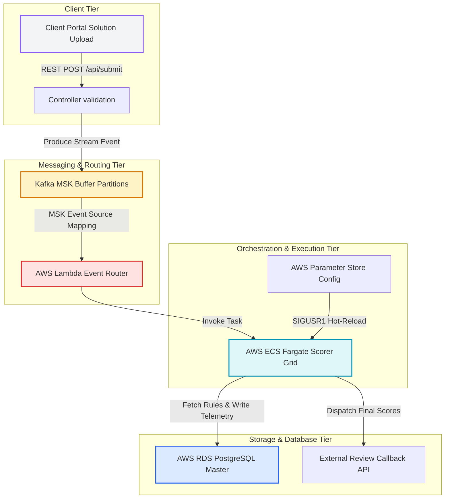

# Enterprise AWS Serverless Scoring Infrastructure and Cluster Cockpit

This repository hosts a production-grade, highly optimized Full-Stack DevOps Visualizer Cockpit and On-Demand scoring platform. The system is designed to simulate a transition from legacy monolithic servers into a modern, decoupled, event-driven, and highly resilient serverless topology on Amazon Web Services (AWS).

---

## 1. System Architecture Overview

The platform uses a decoupled, event-driven architecture designed to process algorithmic code submissions under heavy parallel loads. The theoretical framework spans across ingestion buffers, automated event routing, containerized sandboxes, and highly available persistence databases.



---

## 2. Core Architectural Components

### 2.1 Decoupled Ingestion and Queue Buffering
Submissions uploaded through the Client Portal are processed as short-lived scoring payloads. Instead of allocating persistent server memory or spinning up immediate threads that expose the infrastructure to compute lockouts, the backend produces structured events into an active Kafka MSK topic.
* **Partitioned Queue Management**: Kafka buffers the high-throughput ingestion spikes, maintaining consumer offsets even during sudden traffic surges.
* **Consumer Decoupling**: Compute instances do not directly interface with the submission portals. The queue acts as a strict firewall, preventing denial-of-service threats on the core evaluation grid.

### 2.2 AWS Lambda Dynamic Orchestrator
An event-source mapping links the Kafka MSK partition queue to an AWS Lambda router. When new submission events are pushed to the partition topics, Lambda executes inside a highly optimized microVM environment to evaluate cluster capacity.
* **Auto-Scaling Invocation**: Lambda calculates the queue depth and triggers container instantiations dynamically inside the ECS Fargate cluster.
* **Zero-Idle Standby**: The orchestrator relies on zero active runner processes during low-load intervals, eliminating ongoing compute costs.

### 2.3 Containerized Execution Sandbox (ECS Fargate)
Algorithmic evaluations execute within isolated AWS ECS Fargate tasks running on-demand containers. This isolates contestant code execution and guarantees high security:
* **Multi-Layer Isolation**: Each submission runs in a separate kernel-namespace sandbox. Memory boundaries are strictly enforced to prevent cross-contestant memory exposure or server environment manipulation.
* **SSM Parameter Store Hook**: Upon instantiation, Fargate container processes retrieve environment parameters, validation timeouts, and scoring policies dynamically from the AWS Parameter Store (SSM).

### 2.4 High Availability Multi-AZ Database Layer
Persistent transaction metrics, challenge definitions, and evaluation logs are consolidated inside an AWS RDS PostgreSQL database. The data engine features Multi-Availability Zone replication:
* **Active-Passive Synchronous Replication**: Writes are synchronously committed to the primary instance in the default zone and cloned to the secondary standby instance in an alternate availability zone.
* **Automated Failover Probing**: If the primary database experiences a hardware failure, EKS and Lambda telemetry controllers redirect write queries to the newly promoted primary master standby instance.

---

## 3. Technical Stack and Architectural Specifications

This section details the theoretical specifications and inner workings of every technology stack configured in the Marathon Scorer repository.

| Component | Technology Stack | Primary Role & Responsibility | Key Engineering Heuristics |
| :--- | :--- | :--- | :--- |
| **Frontend Web Tier** | React, Vite, TypeScript, TanStack Query | Reactive user cockpit, real-time EKS network topology animations, dynamic regional state-machines. | Staggered visual telemetry scanning, bi-directional terminal synchronization, glassmorphism dashboard aesthetics. |
| **Backend Service Tier** | Node.js, Express, TypeScript, Drizzle ORM | Event controller layers, custom relational database adapters, multi-tier execution management. | Circular-reference reference scanning with visited set buffers, array-destructured insert return contracts. |
| **Ingestion Microservice** | Go (Golang), lib/pq driver | Concurrent metrics aggregation and high-throughput telemetry ingestion backend. | Go channels, thread-safe connection pooling, automated TCP startup ping retry/keep-alive resiliency loops. |
| **Evaluation Scorer** | Java (JDK 17), Cellular Automata | Sandbox algorithmic scorer executing in isolated container tasks. | 50x50 Toroidal cell grid neighbor checks, peak-survived colony score normalization, SSM parameter resolution. |
| **Cloud & DevOps IaC** | Terraform, AWS Lambda, ECS, MSK, RDS | Event-driven container orchestrations, Multi-AZ database clustering, VPC private networks. | MSK backlog event-source mappings, dynamic ECS container scaling, Multi-AZ active-passive hot synchronous failovers. |

### 3.1 Frontend Web Tier (Vite, React, TypeScript, TanStack Query, Vanilla HSL CSS)

* **Vite Build System**: A high-performance, next-generation build tool leveraging native ES modules for ultra-fast Hot Module Replacement (HMR) and Rollup-based asset optimization, dramatically reducing development start times and streamlining production bundles.
* **Reactive Client-State Management**: Built entirely on standard React hooks (`useState`, `useEffect`, `useMemo`, `useCallback`) and custom context. The EKS visualizer coordinates dynamic region swaps through declarative finite state machines (managing `isScanning`, `scanStep`, and `connectingHosts` state flows), updating telemetry contexts safely across components.
* **TanStack Query (React Query) Integration**: Implements a clean, standardized asynchronous caching and server-state synchronization framework:
  * *Query Key Schema*: Models requests using unique, structured keys (`["challenges"]`, `["submissions"]`, `["metrics"]`) to guarantee deterministic invalidation.
  * *Caching & Stale-Time Rules*: Customizes state caching (`staleTime: 5000` and `cacheTime: 300000`), allowing pre-fetched data to satisfy instant route transitions while background fetches update lists transparently.
  * *Automatic Resiliency Policies*: Configured with standard retry policies (`retry: 3`) and global boundary hooks to capture connection loss or internal database resets gracefully.
  * *Mutation Pipelines*: Orchestrates data operations via standard mutation hooks (`useMutation`), triggering optimistic updates and invoking `queryClient.invalidateQueries` to synchronize cockpit displays immediately post-submission.
* **Premium Tailored HSL CSS**: Designed without bulky runtime UI libraries. The interface leverages custom CSS properties, flexible flex/grid layouts, responsive SVG telemetry sweeps, and highly polished glassmorphism panels to create an elite, immersive user experience.

### 3.2 Backend Service Tier (Node.js, Express, TypeScript, Multi-Tier Architecture)

* **Decoupled Multi-Tier Layering**: Strictly organizes backend concerns across distinct system boundaries:
  * *Router Layer*: Standardizes API routing, intercepting requests and applying Express JSON body parsers.
  * *Controller Layer*: Directs flow orchestration, decoding route parameters and generating structured, type-safe API packages.
  * *Service Layer*: Hosts abstract business workflows, coordinating scoring run simulations and mock infrastructure events.
  * *Repository Layer*: Interfaces directly with the database engine, decoupling sql-level query logic from route handlers.
* **High-Fidelity Drizzle ORM Simulator**:
  * *Engineering Intent*: Provisioned to allow full-stack local operations when access to an external PostgreSQL RDS instance is unavailable, preventing connection errors while supporting standard Drizzle syntax structures.
  * *Circular Reference Resolution (Drizzle Object Graph Resolver)*: Drizzle column descriptors and table relations contain nested, circular references linking back to core database schemas. To prevent recursive key scanning from triggering stack overflows (`Maximum call stack size exceeded`), the simulator incorporates a visited reference register using a JavaScript `Set`. The algorithm ignores internal ORM keys (`table`, `schema`, `columns`, `config`, `shouldInlineParams`) and filters out SQL chunk arrays to extract valid primitives safely.
  * *Array Destructuring `.returning()` Contract*: Relational database drivers resolve inserts as lists. To prevent runtime type errors during destructuring assignments (e.g., `const [result] = await db.insert(...).returning()`), the mock database `.returning()` pipeline is built to always yield a standard iterable array, satisfying the ORM type contracts.

### 3.3 Go Ingestion Aggregator Microservice (Go Standard Library, lib/pq)

* **High-Performance Concurrency Model**: Engineered in Go to support lightweight, high-speed HTTP metrics ingestion. Telemetry payloads dispatched from isolated container tasks are processed in a highly concurrent environment.
* **Resilient Connection Pooling & Keep-Alives**:
  * *Thread-Safe Pooling*: Leverages the standard Go `database/sql` driver, managing client sessions across a highly efficient connection pool to prevent database driver exhaustion.
  * *Idempotent Startup Retry Loop*: If the primary database experiences a cold boot or temporary failover network delay, the aggregator executes a robust startup retry routine, attempting to ping the target host up to five times with a three-second delay between checks.
* **Concurrent Routing Engine**: Binds to a dedicated socket and decodes inbound JSON telemetry bodies with low-allocation decoders (`json.NewDecoder`). Records transaction metrics directly into the centralized `infra_metrics` database ledger, providing real-time data to EKS visualizer charts.

### 3.4 Java Containerized Scoring Engine (Java 17, Cellular Automata)

* **Sandbox Task Invocation**: Scorer instances are containerized inside Docker and executed as on-demand tasks within AWS ECS Fargate. The Java bootstrapping process (`Scorer.java`) resolves runtime properties dynamically:
  * Retrieves environment parameters (`MARATHON_CHALLENGE_ID`, `MARATHON_SUBMISSION_ID`, and `SSM_PARAMETER_PATH`).
  * Queries the AWS Systems Manager (SSM) Parameter Store to fetch challenge-specific timing constraints, evaluation parameters, and scoring modes.
* **BioSlime Survival Cellular Automata Engine**:
  * *Toroidal Coordinate Wrapping*: The core simulation runs on a 50x50 cellular automata grid. Grid boundary checks wrap coordinates modularly (`(r + dr + GRID_SIZE) % GRID_SIZE`), modeling a seamless toroidal space.
  * *Biological State Transitions*: Implements Conway-style cellular growth and decay loops: existing colonies persist if they have two or three active neighbors, while dead cells spawn slime colonies if they border exactly three active neighbor cells.
  * *Provisional Score Normalization*: Evaluates solutions based on the peak active slime population recorded across 200 ticks, calculating a normalized double score capped at a 100.0 baseline (`Math.min(100.0, baseScore / 10.0)`).
* **Asynchronous Callback Gateway**: On simulation exit, the scoring container constructs a telemetry package and dispatches a secure HTTP POST callback to the review portal (`REVIEW_API_URL`), recording execution times, status, and scores before terminating.

### 3.5 Infrastructure as Code & Cloud Orchestration (Terraform, AWS VPC, EKS, Multi-AZ RDS)

* **Terraform Declarative Blueprints**: Standardizes the complete infrastructure deployment topology inside `/terraform`:
  * *VPC Networking Heuristics*: Designs a private Virtual Private Cloud (VPC) with segregated subnets (public subnets for application ingress load balancers, private subnets for EKS compute nodes, and isolated backend subnets for databases).
  * *AWS MSK (Kafka) Queue Partitions*: Deploys a managed streaming Kafka cluster configured with multiple partitions, decoupling client uploads from scoring compute grids.
  * *AWS Lambda Event Orchestrators*: Configures Serverless Lambda microVMs triggered by MSK topic backlogs. Calculates queue latency and triggers on-demand container executions.
  * *Multi-AZ RDS High Availability*: Sets up a PostgreSQL RDS cluster with active-passive synchronous replication across separate Availability Zones. Telemetry controllers perform automated health checks to reroute connection pools if a regional node fails.

---

## 4. Interactive DevOps Visualizer State Machines

The cockpit dashboard features an advanced Cluster Orchestration Visualizer simulating real-world failures, autoscaling traffic events, and Multi-Region cluster telemetry state machines.

### 3.1 Bi-Directional AWS Region Selection Synchronization
The visualizer synchronizes the UI Region Select component with the AWS Cloud Shell terminal console. When a user updates the active region, the platform processes the change through a strict sequential pipeline:

```
[UI Select Dropdown / Cloud Shell Input]
                  │
                  ▼
[1. Command Shell Execution Logging]
 ── aws-shell $ export AWS_DEFAULT_REGION=<region>
 ── aws-shell $ aws EKS update-kubeconfig --name scorer-cluster --region <region>
                  │
                  ▼
[2. Global SVG Scanner Overlay Activation]
 ── Pulse Scanner sweep indicates active connection context switch
                  │
                  ▼
[3. Staggered EKS Telemetry Probing]
 ── Host-Node-01: Probing ──► Telemetry Verified (900ms)
 ── Host-Node-02: Probing ──► Telemetry Verified (1400ms)
 ── Host-Node-03: Probing ──► Telemetry Verified (1900ms)
                  │
                  ▼
[4. Active Pod Eviction & Migration]
 ── Gracefully migrate all running task pods to new Availability Zones
```

### 3.2 EKS Node Outage and Incident Eviction Mechanics
To demonstrate structural disaster recovery patterns, the visualizer allows users to simulate a severe hardware failure on compute hosts (specifically Host-Node-02 in AZ B). 

```
                                [Hardware Failure Injected]
                                             │
                                             ▼
                             [Status Set to NotReady / OFFLINE]
                                             │
                                             ▼
                           [Active Pod Eviction Initialized]
                                             │
                                             ▼
                     ┌───────────────────────┴───────────────────────┐
                     ▼                                               ▼
         [Terminate Evicted Pods]                        [Spawn Replacement Pods]
     ── RAM / CPU stats reset to zero               ── Staggered placement on Node 1 / 3
     ── Progress markers wiped                      ── Transition to "Image Pulling" state
```

---

## 5. Multi-Layer DevOps Flowcharts

### 4.1 End-to-End Solution Scoring Pipeline

The flowchart below traces a contestant submission from the initial code upload to the final score callback dispatch:

```
+-----------------------------------------------------------------------------------+
| 1. INGESTION                                                                      |
|    Contestant Solution Code Upload  --> REST API Validation  --> Kafka Partition  |
+-----------------------------------------------------------------------------------+
                                                                       │
                                                                       ▼
+-----------------------------------------------------------------------------------+
| 2. DISPATCH & SCHEDULING                                                          |
|    Partition Backlog Trigger --> AWS Lambda MicroVM Invoked --> ECS Fargate Task  |
+-----------------------------------------------------------------------------------+
                                                                       │
                                                                       ▼
+-----------------------------------------------------------------------------------+
| 3. SANDBOX ISOLATION & PROVISIONING                                               |
|    Pull Scorer Container Image --> Retrieve SSM Config Parameters --> Run Scorer  |
+-----------------------------------------------------------------------------------+
                                                                       │
                                                                       ▼
+-----------------------------------------------------------------------------------+
| 4. PERSISTENCE & TELEMETRY                                                        |
|    Execute Cellular Automata --> Write RDS Transaction Master --> Score Callback  |
+-----------------------------------------------------------------------------------+
```

### 4.2 Multi-AZ Sequential Telemetry Connection

The sequential network scanning flowchart illustrates how EKS host controllers probe and link regional compute nodes when switching AWS endpoints:

```
               [Switched Cloud Provider Region Context]
                                  │
      ┌───────────────────────────┼───────────────────────────┐
      │ Zone A                    │ Zone B                    │ Zone C
      ▼                           ▼                           ▼
[Probe Host-Node-01]        [Probe Host-Node-02]        [Probe Host-Node-03]
  Telemetry Request           Telemetry Request           Telemetry Request
      │                           │                           │
  (900ms Delay)               (1400ms Delay)              (1900ms Delay)
      │                           │                           │
      ▼                           ▼                           ▼
[Socket Established]        [Socket Established]        [Socket Established]
  Link Active                 Link Active (If Healthy)    Link Active
      │                           │                           │
      ▼                           ▼                           ▼
[Host-01: Online]           [Host-02: Online/Offline]   [Host-03: Online]
```

---

## 6. Theoretical CI/CD Pipeline and Static Verification Case Study

This section details the theoretical framework of the automated continuous integration and continuous deployment (CI/CD) pipelines configured inside this repository.

### 5.1 CI/CD Directed Acyclic Graph (DAG) Topology

The deployment workflows are modeled as a Directed Acyclic Graph where execution blocks are strictly separated into stages. The diagram below illustrates the pipeline dependencies:

```
[GitHub Push Event] ──► [Job 1: Build & Test Applications] (Vite/TypeScript Compile Checks)
                                       │
                                       ▼ (Requires Success)
                        [Job 2: Deploy to AWS Fargate] (Docker Build/Push & ECS Service Task Sync)
```

### 5.2 Case Study: Workflow Ingestion Parameter Resolution

During continuous integration runs, a parsing error was identified causing Job 1 (`Build & Test Applications`) to fail immediately within 7 seconds of initiation, consequently skipping the Fargate deployment step:

* **Symptom**: The runner runner-agent aborted execution at the Node environment provisioning step.
* **Root Cause Analysis**: Inside `.github/workflows/deploy.yml`, the environment setup step configured using `actions/setup-node@v3` declared an invalid, unrecognized schema parameter parameter key:
  ```yaml
  with:
    node-size: 20
  ```
  The workflow parser strictly validates inputs against the actions configuration schema definition. The key `node-size` is non-existent, causing the runner manager to fail the build step during startup verification.
* **Mitigation & Structural Fix**: The parameter key was updated to its valid standard representation:
  ```yaml
  with:
    node-version: 20
  ```
  This correction enables the setup-node action block to locate and provision Node.js runtime version 20, successfully proceed to package lock installation (`npm ci`), and run full TypeScript compiler validation check tasks (`npm run check`).

---

## 7. High-Fidelity Database Simulator and Diagnostic Case Studies

This section details the theoretical analysis, diagnostics, and architectural resolutions applied to the platform's simulated data layer, solution ingestion pipelines, and visual spec grids.

### 6.1 Diagnostic Case Study 1: Persistent Simulator memoryStore Context
* **Symptom**: The Challenges tab in the main navigation viewport and the target challenge selector in the Submissions form displayed empty views.
* **Root Cause**: During backend instantiation, the database simulator was initialized twice: first when the module was loaded synchronously during repository imports, and secondly when `initializeDatabase()` checked connection timeouts during Express startup. Because the closure-scoped `memoryStore` and sequencing counters were defined inside `bootstrapInMemorySimulator()`, the secondary bootstrap created a fresh store, discarding the initial seeded challenges.
* **Mitigation**: Lifted `memoryStore` and ID sequence counters out of the bootstrap closure to the module scope in `server/db.ts`. This ensures a single shared memory allocation across all bootstrapping phases and module-level imports.

### 6.2 Diagnostic Case Study 2: Circular Dependency Stack Overflows in Drizzle Parsing
* **Symptom**: POST requests to the `/api/submissions` endpoint crashed with a server 500 error: `Maximum call stack size exceeded`.
* **Root Cause**: The repository layer executes queries using Drizzle's real operator functions (e.g., `eq(submissions.id, id)`). The return value is a complex operator expression containing deep circular references back to the parent table and sibling column metadata. The simulator's recursive `inspect` function in `extractWhereValue()` attempted to scan every object property, entering an infinite loop traversing circular columns and throwing a stack overflow.
* **Mitigation**: Enhanced the recursive parser in `server/db.ts` to:
  * Maintain a visited object register using a JavaScript `Set` to prevent recursive re-entry.
  * Skip Drizzle internal structural properties (`table`, `schema`, `columns`, `config`, and `shouldInlineParams`).
  * Skip internal SQL raw text chunk arrays by restricting `value` assignment to non-array primitive types, preventing parameters from being overwritten by trailing empty string query arrays (`[""]`).

### 6.3 Diagnostic Case Study 3: Drizzle returning() Array Destructuring Contract
* **Symptom**: Creating a new submission threw a TypeError: `(intermediate value) is not iterable`.
* **Root Cause**: The Repository layer executes insertions using destructuring: `const [result] = await db.insert(...).values(...).returning()`. The simulator's `.returning()` method resolved to a single item object for non-array inserts, which failed destructuring because a plain object is not an iterable.
* **Mitigation**: Refactored the `insert` simulator to always resolve `.returning()` to the full `insertedItems` array (conforming to real Drizzle ORM specifications), while standard `.then()` Promise chains continue to resolve to the single inserted item.

### 6.4 Diagnostic Case Study 4: Solution Uploader Precision Target Matcher
* **Symptom**: Solution files uploaded from the global sidebar dashboard uploaded silently or mapped incorrectly to a default challenge without feedback.
* **Root Cause**: The uploader silently aborted if active challenges were empty. Additionally, the parser lacked challenge identification mapping.
* **Mitigation**: 
  * Integrated warning prompts in `App.tsx` if file uploads are initiated before active scorer challenges have synchronized.
  * Added extension parsing to resolve environments (.py matches Python, .ts/.js matches TypeScript, and others default to Java).
  * Programmed uploader keyword scans on lowercase filenames (`slime` -> BioSlime Survival, `astro` or `router` -> AstroRouter Routing, `grid` -> MegaGrid Resource Optimizer) with graceful fallbacks.
  * Configured a floating glassmorphism alert notification that flashes container deployment details on successful uploads.

### 6.5 Diagnostic Case Study 5: Duplicate Spec Grid Card Column Mapping
* **Symptom**: In the Challenges tab, the OUTPUT SPEC column duplicated the text of the INPUT SPEC column.
* **Root Cause**: The React component template in `App.tsx` mapped both input and output specification rows to the database column `c.inputSpec`.
* **Mitigation**: Corrected the template binding in the second spec card details block to map to the `c.outputSpec` database property.


