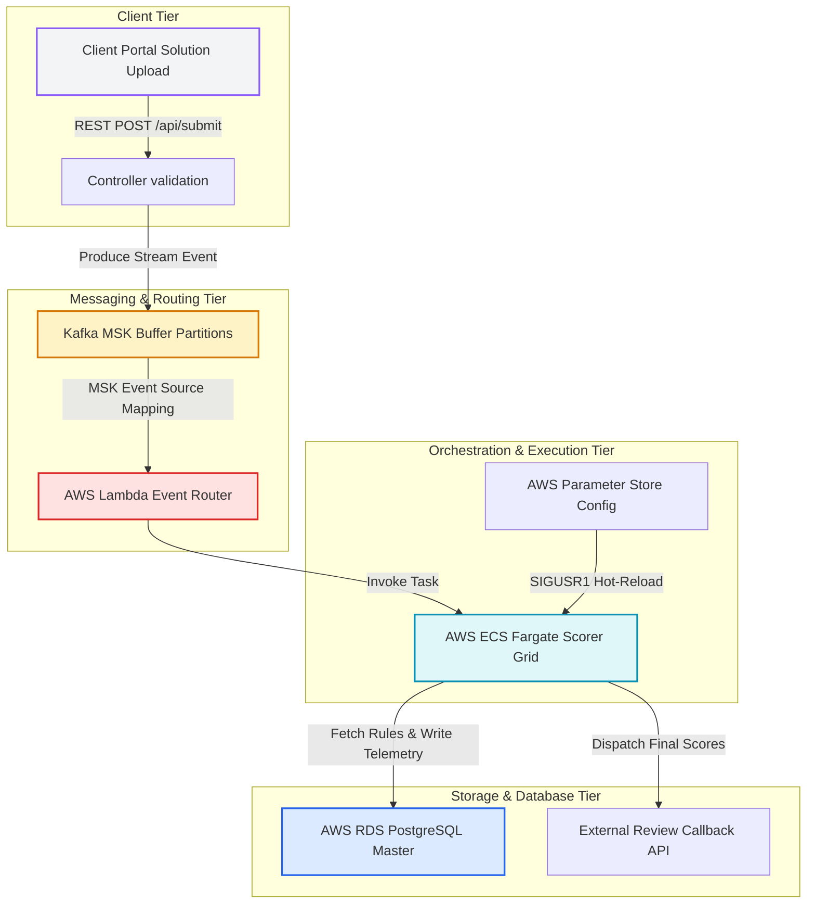

# Enterprise AWS Serverless Scoring Infrastructure and Cluster Cockpit

This repository hosts a production-grade, highly optimized Full-Stack DevOps Visualizer Cockpit and On-Demand scoring platform. The system is designed to simulate a transition from legacy monolithic servers into a modern, decoupled, event-driven, and highly resilient serverless topology on Amazon Web Services (AWS).

---

## 1. System Architecture Overview

The platform uses a decoupled, event-driven architecture designed to process algorithmic code submissions under heavy parallel loads. The theoretical framework spans across ingestion buffers, automated event routing, containerized sandboxes, and highly available persistence databases.



---

## 2. Core Architectural Components

### 2.1 Decoupled Ingestion and Queue Buffering
Submissions uploaded through the Client Portal are processed as short-lived scoring payloads. Instead of allocating persistent server memory or spinning up immediate threads that expose the infrastructure to compute lockouts, the backend produces structured events into an active Kafka MSK topic.
* **Partitioned Queue Management**: Kafka buffers the high-throughput ingestion spikes, maintaining consumer offsets even during sudden traffic surges.
* **Consumer Decoupling**: Compute instances do not directly interface with the submission portals. The queue acts as a strict firewall, preventing denial-of-service threats on the core evaluation grid.

### 2.2 AWS Lambda Dynamic Orchestrator
An event-source mapping links the Kafka MSK partition queue to an AWS Lambda router. When new submission events are pushed to the partition topics, Lambda executes inside a highly optimized microVM environment to evaluate cluster capacity.
* **Auto-Scaling Invocation**: Lambda calculates the queue depth and triggers container instantiations dynamically inside the ECS Fargate cluster.
* **Zero-Idle Standby**: The orchestrator relies on zero active runner processes during low-load intervals, eliminating ongoing compute costs.

### 2.3 Containerized Execution Sandbox (ECS Fargate)
Algorithmic evaluations execute within isolated AWS ECS Fargate tasks running on-demand containers. This isolates contestant code execution and guarantees high security:
* **Multi-Layer Isolation**: Each submission runs in a separate kernel-namespace sandbox. Memory boundaries are strictly enforced to prevent cross-contestant memory exposure or server environment manipulation.
* **SSM Parameter Store Hook**: Upon instantiation, Fargate container processes retrieve environment parameters, validation timeouts, and scoring policies dynamically from the AWS Parameter Store (SSM).

### 2.4 High Availability Multi-AZ Database Layer
Persistent transaction metrics, challenge definitions, and evaluation logs are consolidated inside an AWS RDS PostgreSQL database. The data engine features Multi-Availability Zone replication:
* **Active-Passive Synchronous Replication**: Writes are synchronously committed to the primary instance in the default zone and cloned to the secondary standby instance in an alternate availability zone.
* **Automated Failover Probing**: If the primary database experiences a hardware failure, EKS and Lambda telemetry controllers redirect write queries to the newly promoted primary master standby instance.

---

## 3. Interactive DevOps Visualizer State Machines

The cockpit dashboard features an advanced Cluster Orchestration Visualizer simulating real-world failures, autoscaling traffic events, and Multi-Region cluster telemetry state machines.

### 3.1 Bi-Directional AWS Region Selection Synchronization
The visualizer synchronizes the UI Region Select component with the AWS Cloud Shell terminal console. When a user updates the active region, the platform processes the change through a strict sequential pipeline:

```
[UI Select Dropdown / Cloud Shell Input]
                  │
                  ▼
[1. Command Shell Execution Logging]
 ── aws-shell $ export AWS_DEFAULT_REGION=<region>
 ── aws-shell $ aws EKS update-kubeconfig --name scorer-cluster --region <region>
                  │
                  ▼
[2. Global SVG Scanner Overlay Activation]
 ── Pulse Scanner sweep indicates active connection context switch
                  │
                  ▼
[3. Staggered EKS Telemetry Probing]
 ── Host-Node-01: Probing ──► Telemetry Verified (900ms)
 ── Host-Node-02: Probing ──► Telemetry Verified (1400ms)
 ── Host-Node-03: Probing ──► Telemetry Verified (1900ms)
                  │
                  ▼
[4. Active Pod Eviction & Migration]
 ── Gracefully migrate all running task pods to new Availability Zones
```

### 3.2 EKS Node Outage and Incident Eviction Mechanics
To demonstrate structural disaster recovery patterns, the visualizer allows users to simulate a severe hardware failure on compute hosts (specifically Host-Node-02 in AZ B). 

```
                                [Hardware Failure Injected]
                                             │
                                             ▼
                             [Status Set to NotReady / OFFLINE]
                                             │
                                             ▼
                           [Active Pod Eviction Initialized]
                                             │
                                             ▼
                     ┌───────────────────────┴───────────────────────┐
                     ▼                                               ▼
         [Terminate Evicted Pods]                        [Spawn Replacement Pods]
     ── RAM / CPU stats reset to zero               ── Staggered placement on Node 1 / 3
     ── Progress markers wiped                      ── Transition to "Image Pulling" state
```

---

## 4. Multi-Layer DevOps Flowcharts

### 4.1 End-to-End Solution Scoring Pipeline

The flowchart below traces a contestant submission from the initial code upload to the final score callback dispatch:

```
+-----------------------------------------------------------------------------------+
| 1. INGESTION                                                                      |
|    Contestant Solution Code Upload  --> REST API Validation  --> Kafka Partition  |
+-----------------------------------------------------------------------------------+
                                                                       │
                                                                       ▼
+-----------------------------------------------------------------------------------+
| 2. DISPATCH & SCHEDULING                                                          |
|    Partition Backlog Trigger --> AWS Lambda MicroVM Invoked --> ECS Fargate Task  |
+-----------------------------------------------------------------------------------+
                                                                       │
                                                                       ▼
+-----------------------------------------------------------------------------------+
| 3. SANDBOX ISOLATION & PROVISIONING                                               |
|    Pull Scorer Container Image --> Retrieve SSM Config Parameters --> Run Scorer  |
+-----------------------------------------------------------------------------------+
                                                                       │
                                                                       ▼
+-----------------------------------------------------------------------------------+
| 4. PERSISTENCE & TELEMETRY                                                        |
|    Execute Cellular Automata --> Write RDS Transaction Master --> Score Callback  |
+-----------------------------------------------------------------------------------+
```

### 4.2 Multi-AZ Sequential Telemetry Connection

The sequential network scanning flowchart illustrates how EKS host controllers probe and link regional compute nodes when switching AWS endpoints:

```
               [Switched Cloud Provider Region Context]
                                  │
      ┌───────────────────────────┼───────────────────────────┐
      │ Zone A                    │ Zone B                    │ Zone C
      ▼                           ▼                           ▼
[Probe Host-Node-01]        [Probe Host-Node-02]        [Probe Host-Node-03]
  Telemetry Request           Telemetry Request           Telemetry Request
      │                           │                           │
  (900ms Delay)               (1400ms Delay)              (1900ms Delay)
      │                           │                           │
      ▼                           ▼                           ▼
[Socket Established]        [Socket Established]        [Socket Established]
  Link Active                 Link Active (If Healthy)    Link Active
      │                           │                           │
      ▼                           ▼                           ▼
[Host-01: Online]           [Host-02: Online/Offline]   [Host-03: Online]
```

---

## 5. Theoretical CI/CD Pipeline and Static Verification Case Study

This section details the theoretical framework of the automated continuous integration and continuous deployment (CI/CD) pipelines configured inside this repository.

### 5.1 CI/CD Directed Acyclic Graph (DAG) Topology

The deployment workflows are modeled as a Directed Acyclic Graph where execution blocks are strictly separated into stages. The diagram below illustrates the pipeline dependencies:

```
[GitHub Push Event] ──► [Job 1: Build & Test Applications] (Vite/TypeScript Compile Checks)
                                       │
                                       ▼ (Requires Success)
                        [Job 2: Deploy to AWS Fargate] (Docker Build/Push & ECS Service Task Sync)
```

### 5.2 Case Study: Workflow Ingestion Parameter Resolution

During continuous integration runs, a parsing error was identified causing Job 1 (`Build & Test Applications`) to fail immediately within 7 seconds of initiation, consequently skipping the Fargate deployment step:

* **Symptom**: The runner runner-agent aborted execution at the Node environment provisioning step.
* **Root Cause Analysis**: Inside `.github/workflows/deploy.yml`, the environment setup step configured using `actions/setup-node@v3` declared an invalid, unrecognized schema parameter parameter key:
  ```yaml
  with:
    node-size: 20
  ```
  The workflow parser strictly validates inputs against the actions configuration schema definition. The key `node-size` is non-existent, causing the runner manager to fail the build step during startup verification.
* **Mitigation & Structural Fix**: The parameter key was updated to its valid standard representation:
  ```yaml
  with:
    node-version: 20
  ```
  This correction enables the setup-node action block to locate and provision Node.js runtime version 20, successfully proceed to package lock installation (`npm ci`), and run full TypeScript compiler validation check tasks (`npm run check`).

